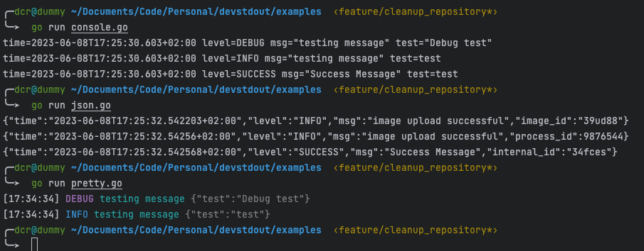

<p align="center" >
    
<h3 align="center">devstdout</h3>
<p align="center">Simple slog wrapper pkg</p>
<p align="center">Build with ❤ in Golang</p>
</p>

<p align="center" >
    
    
    
</p>


# Badges


[](/LICENSE)

<!-- START doctoc generated TOC please keep comment here to allow auto update -->
<!-- DON'T EDIT THIS SECTION, INSTEAD RE-RUN doctoc TO UPDATE -->
**Table of Contents**  *generated with [DocToc](https://github.com/thlorenz/doctoc)*

- [About](#about)
- [Example](#example)
- [Credits](#credits)
- [TO DO](#to-do)
- [Contribution](#contribution)
- [LICENSE](#license)

<!-- END doctoc generated TOC please keep comment here to allow auto update -->

# About

Simple slog wrapper pkg

# Example

```go
package main

import (
    logger "github.com/containerscrew/devstdout/pkg"
)

func main() {
    log := logger.NewLogger(
        logger.OptionsLogger{Level: "warning", AddSource: false, LoggerType: "pretty"},
    )

    log.Debug(
        "testing message",
        logger.PrintMessage("test", "Debug test"),
    )

    log.Info(
        "testing message",
        logger.PrintMessage("test", "test"),
    )

    log.Warning("warning message!")

    log.Success(
        "Success Message",
        logger.PrintMessage("test", "test"),
    )
}
```



# Credits
- [Slog](https://pkg.go.dev/golang.org/x/exp/slog)
- [Git leaks](https://github.com/gitleaks/gitleaks-action)
- [Color library](github.com/fatih/color)
- [To my teacher of Golang @gilmiriam](https://github.com/gilmiriam)

# TO DO

* Add tests
* Code refactor is certainly needed!

# Contribution

Pull requests are welcome! Any code refactoring, improvement, implementation.

# LICENSE

[LICENSE](./LICENSE)
