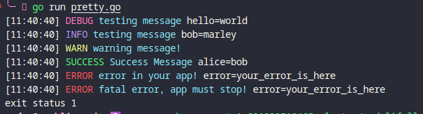
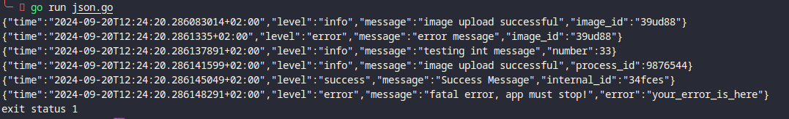

    
<h3 align="center">devstdout</h3>

Simple slog wrapper pkg

Built with ❤ in Golang

    
    
    
    

<!-- START OF TOC !DO NOT EDIT THIS CONTENT MANUALLY-->
**Table of Contents**  *generated with [mtoc](https://github.com/containerscrew/mtoc)*
- [devstdout](#devstdout)
- [Examples](#examples)
  - [Code examples](#code-examples)
  - [Pretty output](#pretty-output)
  - [Json output](#json-output)
- [TO DO](#to-do)
- [License](#license)
<!-- END OF TOC -->

# devstdout

Simple slog wrapper pkg for my Golang projects.

# Examples

## Code examples

* [**json**](./examples/json/json.go)
* [**pretty**](./examples/pretty/pretty.go)
* [**console**](./examples/console/console.go)

## Pretty output

## Json output

# TO DO

* Add tests
* Code refactor is certainly needed!
* AddSource option in logger is too much verbose

# License

[LICENSE](./LICENSE)
